# JudgeX Comprehensive Entity Relationship Diagram (ERD)

This diagram documents the complete database schema for the JudgeX platform, reflecting all features found in the codebase, including the Online Judge, Contest System, Interview Platform, and Course Management.

## Core Domain Models

```mermaid
erDiagram
    %% ======================================================================================
    %% USER MANAGEMENT
    %% ======================================================================================
    USER {
        ObjectId _id PK
        String email UK
        String password
        String name UK "Username"
        String fullname
        String bio
        String avatar
        Boolean isVerified
        String permission "Enum: Member, Admin, Instructor"
        Date lastLogin
        
        %% Contest Participation State
        String joiningContest "Current Active Contest ID"
        String[] joinedContest "History of Contest IDs"
        
        %% Statistics
        Number totalScore
        Number totalAC "Accepted Solutions"
        Number totalAttempt "Total Submissions"
        
        %% Preferences & Security
        String defaultLanguage "e.g., c++17"
        String resetPasswordToken
        Date resetPasswordExpiresAt
        String verificationToken
        Date verificationTokenExpiresAt
        Date createdAt
        Date updatedAt
    }

    %% ======================================================================================
    %% COMPETITIVE PROGRAMMING (Judge & Contests)
    %% ======================================================================================
    PROBLEM {
        ObjectId _id PK
        String id UK "Custom ID (e.g., two-sum)"
        String name UK
        String task "HTML/Markdown Description"
        String[] tags
        Boolean public
        Enum difficulty "easy, medium, hard"
        
        %% Constraints & Settings
        Number point
        Number timeLimit "Seconds"
        Number memoryLimit "MB"
        
        %% Embedded: Starter Code Templates
        Object starterCode "{ cpp: {type, default}, python: ... }"
        
        %% Embedded: Test Cases
        Object[] testcase "Array of {stdin, stdout}"
        
        %% Stats
        Number noOfSubm
        Number noOfSuccess
        String[] contest "Linked Contest IDs"
        Date createdAt
        Date updatedAt
    }

    CONTEST {
        ObjectId _id PK
        String id UK "Custom ID"
        String title UK
        String description
        Date startTime
        Date endTime
        
        %% Relationships
        String[] problems "Array of Problem Custom IDs"
        String[] participant "Array of Usernames"
        
        %% Embedded: Leaderboard (High Performance)
        Object[] standing "Array of User Standing"
    }

    %% Embedded Schema for Contest Standing
    CONTEST_STANDING {
        String user "Username"
        Number[] score "Array of scores per problem"
        Number[] time "Array of time taken per problem"
        String[] status "Array of statuses per problem"
    }

    SUBMISSION {
        ObjectId _id PK
        String author FK "Ref: User Name/ID"
        String forProblem FK "Ref: Problem Custom ID"
        String forContest FK "Ref: Contest Custom ID"
        String language
        String src "Source Code"
        
        %% Execution Result
        Enum status "AC, WA, TLE, MLE, RTE, CE, IE, PENDING"
        Number time "Execution Time (ms)"
        Number memory "Memory Used (KB)"
        Number point "Score"
        Object msg "Compiler Message"
        
        %% Embedded: Test Case Results
        Object[] testcase "Array of {status, time, memory, msg}"
        
        %% Queue Metadata
        String jobId
        String workerId
        Date queuedAt
        Date startedAt
        Date completedAt
        Number retryCount
    }

    %% ======================================================================================
    %% INTERVIEW PLATFORM (Real-time Collaboration)
    %% ======================================================================================
    INTERVIEW {
        ObjectId _id PK
        String title
        Enum type "technical, assessment, mock..."
        String description
        Number duration "Minutes"
        Enum status "pending, active, finished..."
        String inviteToken UK
        
        %% Participants
        ObjectId instructor FK "Ref: User"
        Object candidate "{name, email, joinedAt, isConnected}"
        
        %% Configuration
        String[] allowedLanguages
        Object mediaSettings "{video, audio, screenShare}"
        
        %% Embedded: Question Set
        Object[] questions "Selected Problems"
        
        %% Embedded: Real-time State
        Object state "{code, language, cursorPositions}"
        
        %% Embedded: Session Data
        Object[] messages "Chat History"
        Object[] snapshots "Code History"
        Object[] events "Proctoring Events (tab-switch)"
        Object feedback "Interviewer Evaluation"
        
        Date scheduledAt
        Date startedAt
        Date endedAt
    }

    %% Embedded: Interview Feedback Structure
    INTERVIEW_FEEDBACK {
        Object problemSolving "{score, notes}"
        Object communication "{score, notes}"
        Object codingStyle "{score, notes}"
        Object technicalKnowledge "{score, notes}"
        String recommendation "hire, no_hire..."
    }

    %% ======================================================================================
    %% EDUCATIONAL PLATFORM (LMS)
    %% ======================================================================================
    COURSE {
        ObjectId _id PK
        String title UK
        String description
        String instructor FK "Ref: User"
        String thumbnail
        String[] tags
        Enum difficulty
        Boolean isPublished
        String duration
        
        %% Content
        Object[] videos "Video Lessons"
        Object[] links "Resources"
        
        %% Engagement
        String[] enrolledUsers "Array of User IDs"
        Number rating
        Number ratingCount
        Object[] ratings "{user, value}"
    }

    %% ======================================================================================
    %% ARTIFICIAL INTELLIGENCE
    %% ======================================================================================
    AI_CONVERSATION {
        ObjectId _id PK
        ObjectId user FK "Ref: User"
        ObjectId problem FK "Ref: Problem (Optional)"
        String title "Conversation Title/Context"
        Object[] messages "Embedded: Chat History {role, content, timestamp}"
        Object[] context "Code/State Context"
        Date createdAt
        Date updatedAt
    }

    %% ======================================================================================
    %% RELATIONSHIPS
    %% ======================================================================================

    %% User Connections
    USER ||--o{ SUBMISSION : "authors"
    USER ||--o{ CONTEST : "participates_in"
    USER ||--o{ INTERVIEW : "conducts"
    USER ||--o{ COURSE : "teaches"
    USER }|--|{ COURSE : "enrolls_in"
    USER ||--o{ AI_CONVERSATION : "initiates"

    %% Contest & Problems
    CONTEST }|--|{ PROBLEM : "includes"
    CONTEST ||--|{ CONTEST_STANDING : "maintains"
    CONTEST ||--o{ SUBMISSION : "receives"
    
    %% Problem Connections
    PROBLEM ||--o{ SUBMISSION : "judged_against"
    PROBLEM }|--|| INTERVIEW : "used_in"
    PROBLEM ||--o{ AI_CONVERSATION : "discussed_in"
    
    %% Internal Embeddings (Visualized as relations for clarity)
    INTERVIEW ||--|| INTERVIEW_FEEDBACK : "contains"

```

## Feature Breakdown

### 1. Online Judge System
- **Problems**: Support multiple test cases, custom time/memory limits, and starter code for various languages (`c++`, `python`, `java`, `js`).
- **Submissions**: Track detailed execution metrics (`time`, `memory`) and granular status per test case. Uses a job queue system (`jobId`) for asynchronous processing.
- **Languages**: Supports C, C++, Python, Java, JavaScript, and potentially others via config.

### 2. Contest System
- **Live Leaderboard**: The `standing` array in the Contest model allows for fast O(1) access to the current leaderboard state without expensive aggregation queries during the contest.
- **Participation**: Users join contests, and their performance is tracked via `totalScore` and `totalAC` in their profile.

### 3. Technical Interview Platform
- **Real-time Collaboration**: Stores the current state of the shared code editor (`state.code`, `state.cursorPositions`).
- **Proctoring**: Logs suspicious activities like `tab-switch` in the `events` array.
- **Evaluation**: Comprehensive feedback system (`INTERVIEW_FEEDBACK`) for assessing candidates on multiple criteria.
- **History**: Records code snapshots and chat messages for post-interview review.

### 4. Course Management (LMS)
- **Content Delivery**: Supports video lessons and external resource links.
- **Rating System**: Built-in rating mechanism to track course quality.
- **Enrollment**: Simple array-based enrollment tracking (`enrolledUsers`).

### 5. AI Assistant
- **Context Awareness**: `AI_CONVERSATION` stores the chat history (`messages`) along with the specific `problem` context and code state (`context`).
- **Persistence**: Unlike transient chat, these conversations are saved to allow users to revisit their learning history.
- **Integration**: Directly linked to problems, enabling problem-specific guidance and hints.
