# JudgeX - Online Judging System

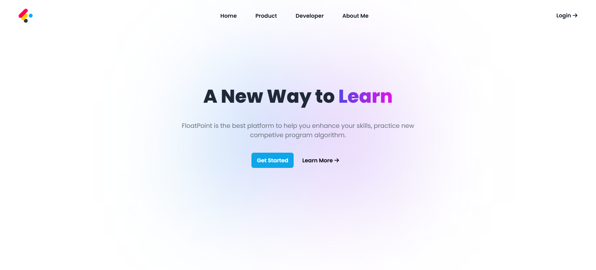

## Overview
JudgeX is a comprehensive online judging system designed to facilitate programming learning and evaluation. Built with the MERN stack (MongoDB, Express, React, Node.js), it provides a complete platform for students and educators.

## Key Features

### 1. Problem Management
- User-friendly interface for solving and submitting coding problems
- Comprehensive problem management system (create, edit, delete)
- Support for various problem types

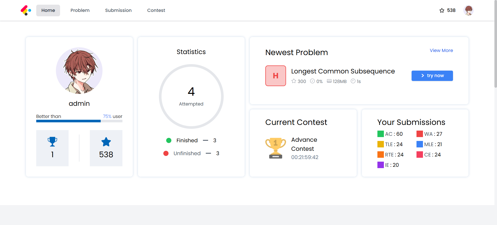

### 2. Course Management System
- Educational content and video management
- Resource organization and distribution
- Student progress tracking
- Interactive learning paths
- Real-time progress monitoring
- Comprehensive course analytics

#### Course Features:
- Video lectures with closed captions
- Downloadable resources and materials
- Interactive coding exercises
- Progress tracking and achievements
- Discussion forums for each course

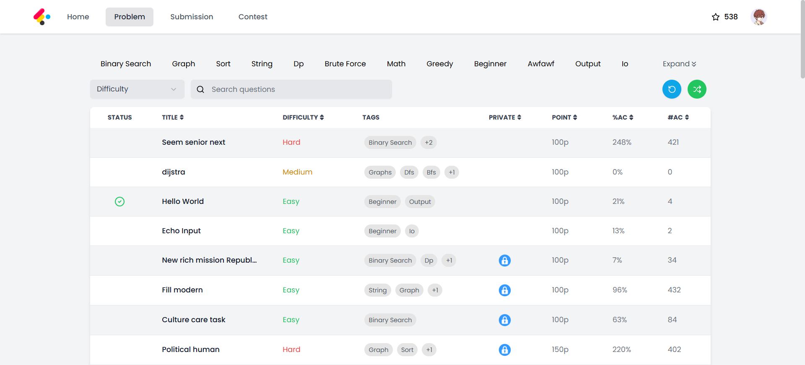
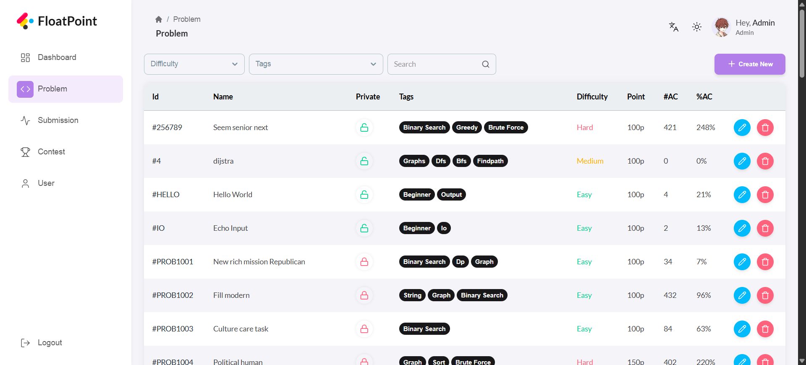
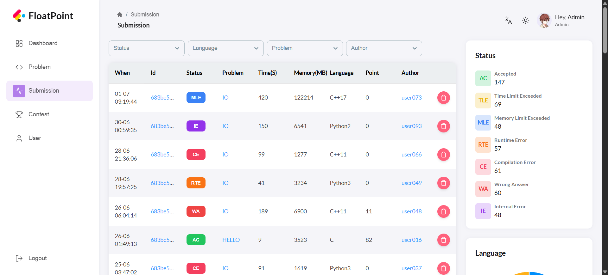
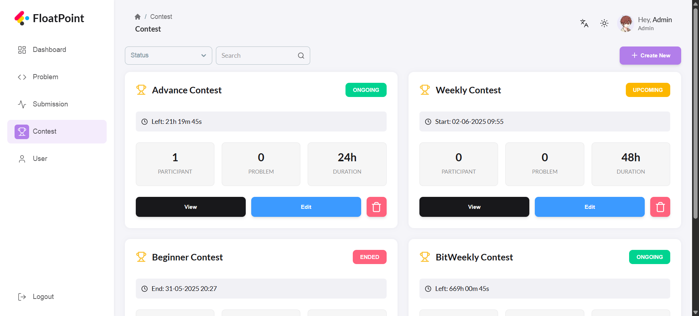

### 3. Contest Management
- Automated programming contest organization
- Contest scheduling and time management
- Contestant ranking and results display

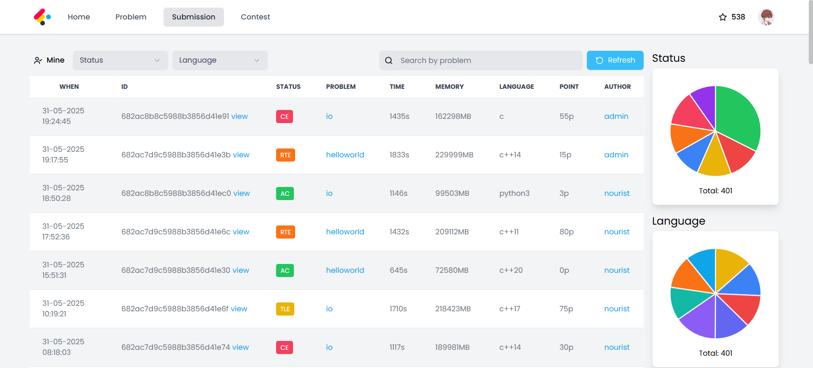

### 4. AI Code Evaluation Feature (New) 🌟
We've integrated an intelligent system for analyzing and evaluating the quality of submitted code. This system provides:

#### Smart Evaluation Features:
- Code quality and structure analysis
- Performance and efficiency improvement suggestions
- Programming best practices identification
- Potential issues and security vulnerabilities detection

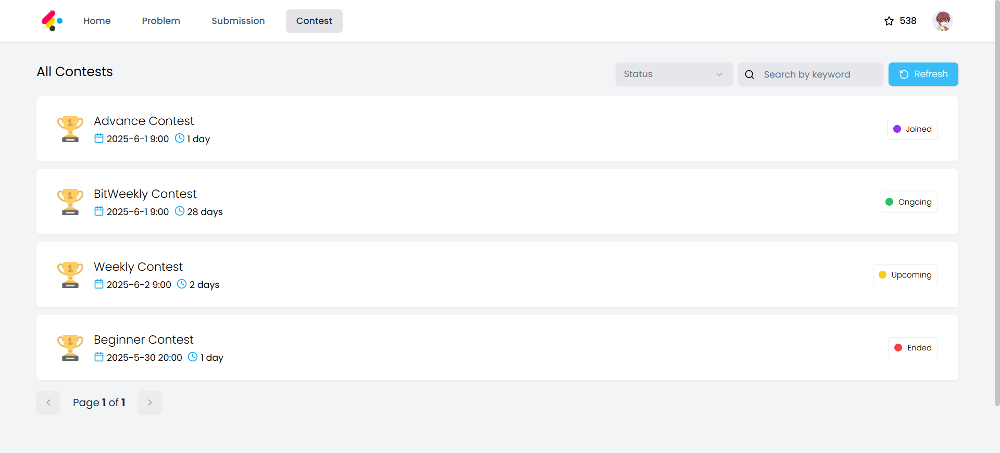

#### Guidelines and Recommendations:
##### Best Practices:
- Use clear and descriptive variable names
- Organize code into logical units
- Add appropriate documentation
- Follow clean code principles

##### What to Avoid:
- Unnecessary code duplication
- Excessive use of global variables
- Unhandled potential errors
- Complex and unreadable code

## Technical Architecture
- **Frontend**: React with TypeScript, Tailwind CSS
- **Admin Dashboard**: React with TypeScript and TanStack Query
- **Backend**: Node.js, Express.js with TypeScript
- **Databases**: 
  - MongoDB (Main Database)
  - Redis (Caching & Session Management)
- **Judging System**: Node.js with Docker

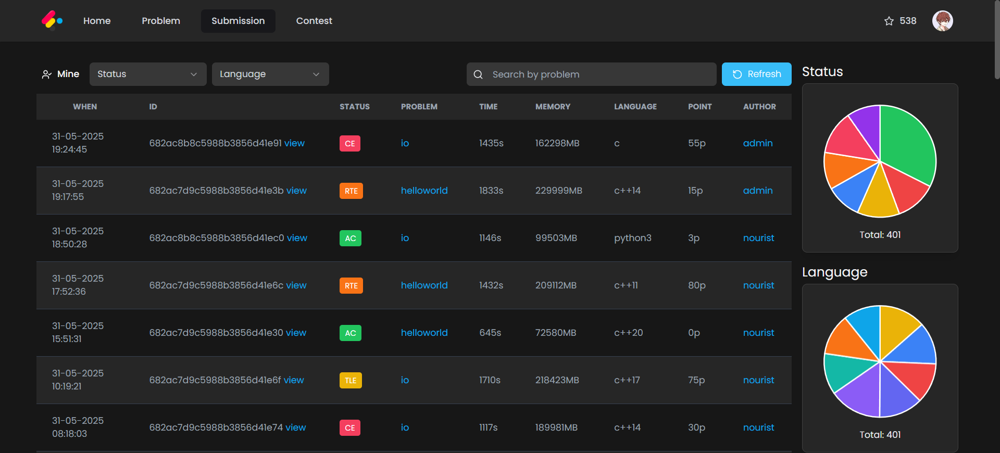

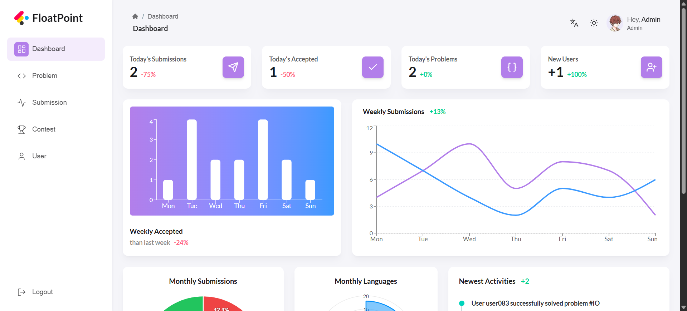

## System Requirements
- Node.js (v18 or higher)
- npm or yarn
- Docker (optional)
- Docker Compose (optional)
- Redis Server
- TypeScript 5.0+

### Development Tools
- VS Code with recommended extensions
- TypeScript and JavaScript linting tools
- Redis CLI for cache management
- MongoDB Compass for database management

## Security and Privacy
- Multi-level authentication and authorization system
- Data protection and user privacy
- Encryption of sensitive information

## Admin Features
The administrative interface provides powerful tools for managing the platform:

- Problem creation and management
- User administration
- Contest organization
- Course content management
- System monitoring and analytics

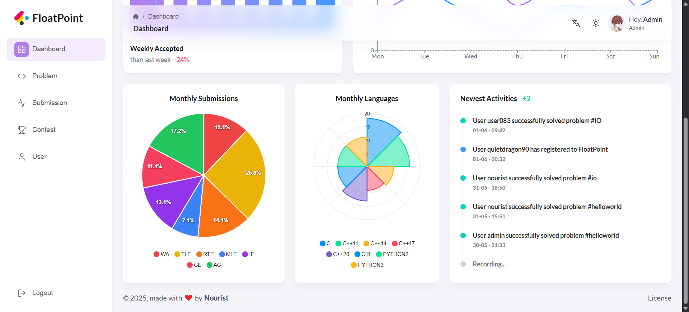

## Student Features
Students can access a range of features:

- Solve programming problems
- Participate in contests
- Access course materials
- Track their progress
- Receive AI-powered code feedback

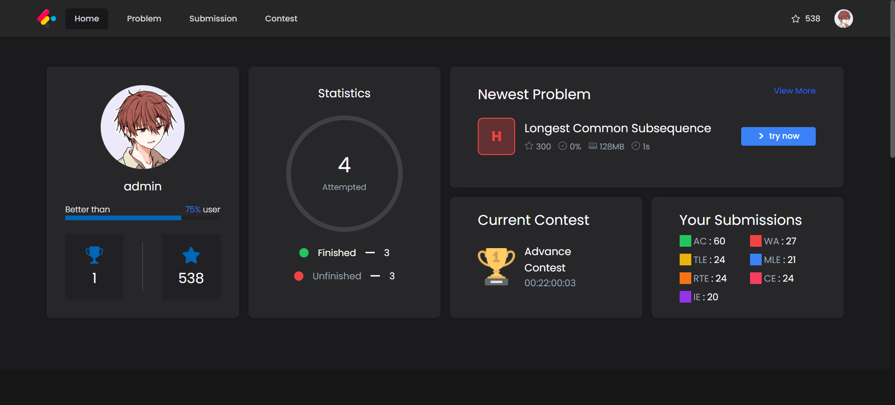

## Future Development
We plan to add more features such as:
- Support for additional programming languages
- Enhanced AI evaluation system
- Collaborative features for users
- UI/UX improvements

## Conclusion
JudgeX is an integrated platform that combines education and programming evaluation, focusing on delivering an outstanding learning experience supported by AI technologies to improve code quality and develop programming skills.

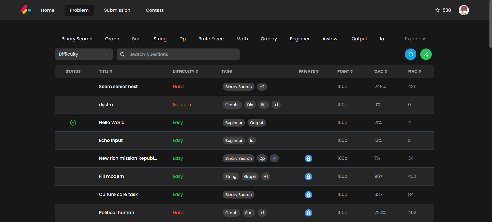